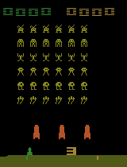

# rl2

Tinkering with RL and other things.

## Results / Open Questions

Entries are ordered from most recent at the top to oldest at the bottom.

### Solving Atari with Program Induction/Synthesis

In Progress

Can program induction or synthesis learn programs that solve Atari games?

### Solving Sparse Reward Atari Environments

In Progress

Solving sparse reward Atari environments, such as Montezuma’s Revenge.

### Basic PPO for Atari

[Basic PPO](src/rl2/ppo.py) with [the Atari configuration](configs/atari.yaml)
achieves a human-normalized score of **161%** on Space Invaders.

## Reading materials 

- [Programmatically Interpretable Reinforcement Learning](https://proceedings.mlr.press/v80/verma18a.html)
  (Verma et al., ICML 2018): Uses a trained neural policy to guide the search for
  interpretable policies written in a domain-specific language. Relevant to
  learning programs that play Atari; evaluated on simulated driving in TORCS.
- [OCAtari: Object-Centric Atari 2600 Reinforcement Learning Environments](https://arxiv.org/abs/2306.08649)
  (Delfosse et al., 2023): Extracts structured object observations from Atari games
  using RAM or vision. Useful for studying programmatic policies over objects
  and their attributes while separating control learning from perception.
